# About Me #

Hey there! I'm G'lek and I'm a software developer with a particular passion for
web technologies and video games, specifically modding them.

My main goals are to create software projects that make development easier and
more streamlined for myself, plus to make the I play more enjoyable.

If somebody else happens to find one of the tools or game mods I've created
useful then that's the cherry on top!

If you've found one of my tools or mods useful I'd love to hear about it! Feel
free to drop me a note on the relevant repository, by email, on social media, or
better yet think about throwing a few coins my way! Even a tiny donation can
really motivate the continuation of my work!

All the mods I make will always be free, my way of saying thank you to the
amazing games and their developers that have given me so many hours of joy over
the years. If you find somebody charging for one of my mods, it's not me! Report
it!

## 🛠️ My Tooling ##

* **Primary Languages:** TypeScript, HTML, CSS/SCSS/SASS, Java, and C#
* **Secondary Languages:** Rust, C/C++, Lua, Python, Odin
* **IDEs**: Visual Studio Code (Insiders usually), vim, Neovim
* **Web Frameworks**: React, Angular, Vue
* **Bundlers**: Vite, Webpack
* **Areas of Interest:** Game development, game modding, web development,
  developer tooling, graphics programming
* **Technologies of Interest**: OpenGL/WebGL/WebGPU, TypeScript, Deno

## 🎮 Featured Projects ##

- **[GTNH Customizer](https://github.com/glektarssza/minecraft-gtnh-customizer)** -
  A mod for Minecraft and the Gregtech: New Horizons mod pack which tweaks
  things more to my personal preferences. Fully customizable!
- **[Webcraft](https://github.com/glektarssza/webcraft)** - A Minecraft clone
  built using web technologies. [v2](https://github.com/glektarssza/webcraft-v2)
  is in the works!
- **[Expanded Gamerules](https://github.com/glektarssza/minecraft-expanded-gamerules)** -
  Minecraft mod that focuses on adding additional gamerules to improve the
  ability of players to customize their gameplay experience.
- **[Create Goggles Curio](https://github.com/glektarssza/minecraft-create-goggles-curio)** -
  A mod that integrates Create's Engineer's Goggles into the Curios mods,
  letting the overlay presented by the Engineer's Goggles show up when they're
  in a Curios' slot in Minecraft 1.16.5 (before integration was added
  officially).

## 📫 Get in Touch ##

- **Email:** [glek@glektarssza.com](mailto:glek@glektarssza.com)
- **Bluesky:** [@glek.glektarssza.com](https://bsky.app/profile/glek.glektarssza.com)

## 📊 GitHub Stats ##

<picture>
  <source
    srcset="./cards/dark/stats.svg"
    media="(prefers-color-scheme: dark)"
    type="image/svg+xml"
  />
  <source
    srcset="./cards/light/stats.svg"
    media="(prefers-color-scheme: light)"
    type="image/svg+xml"
  />
  <source
    srcset="./cards/light/stats.svg"
    media="(prefers-color-scheme: no-preference)"
    type="image/svg+xml"
  />
  
</picture>
<picture>
  <source
    srcset="./cards/dark/top-langs.svg"
    media="(prefers-color-scheme: dark)"
    type="image/svg+xml"
  />
  <source
    srcset="./cards/light/top-langs.svg"
    media="(prefers-color-scheme: light)"
    type="image/svg+xml"
  />
  <source
    srcset="./cards/light/top-langs.svg"
    media="(prefers-color-scheme: no-preference)"
    type="image/svg+xml"
  />
  
</picture>

---

All my projects are covered under custom licensing. Please check the individual
repositories for license details. This licensing generally protects my code from
copying by bad faith actors but does not prevent people from learning from them!

In fact, I encourage people to learn from my work as long as you're not straight
copying my code verbatim!

Cheers! 🍻
